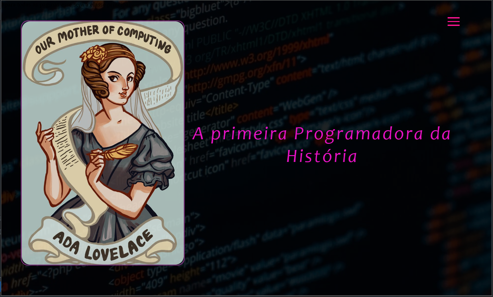
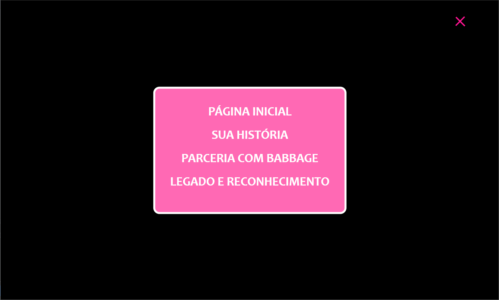
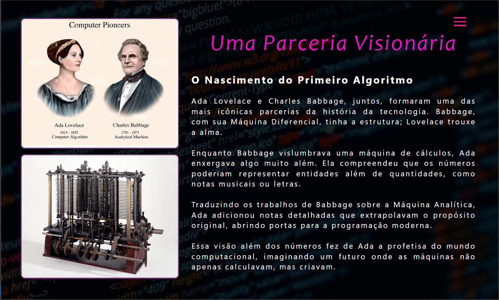
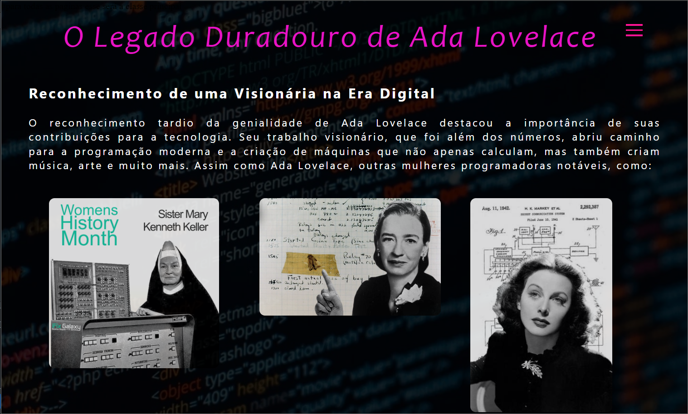

# Projeto Meu Primeiro Blog

Este é o meu primeiro projeto de blog, desenvolvido como parte do meu aprendizado em tecnologias web, incluindo Ruby on Rails, HTML e SCSS. Decidi criar um blog simples, focado em contar a história de Ada Lovelace, a primeira programadora da história, explorando sua vida, contribuições e legado.

# Sobre o Projeto
O projeto Meu Primeiro Blog é uma oportunidade de aplicar na prática as ferramentas e conceitos que venho aprendendo. Utilizando Ruby on Rails como a base do back-end, e HTML/CSS para a estrutura e estilização, consegui construir uma aplicação web completa, que me permitiu:

* Configurar um ambiente de desenvolvimento em Rails;
* Criar modelos e controladores para gerenciar o conteúdo;
* Utilizar HTML para estruturar o conteúdo do blog;
* Estilizar o layout com CSS para criar uma página visualmente agradável.

# Tema do Blog: Ada Lovelace
O blog é dedicado a Ada Lovelace, uma das figuras mais importantes na história da computação. O conteúdo do blog foca nos seguintes tópicos:

* História de Ada Lovelace: Uma visão geral de sua vida e realizações.
* Parceria com Charles Babbage: Como Ada colaborou com Babbage no desenvolvimento da "Máquina Analítica" e escreveu o primeiro algoritmo para ser processado por uma máquina.
* Legado e Reconhecimento: O impacto de Ada Lovelace na história da computação e como seu trabalho é celebrado até hoje.

# Tecnologias Utilizadas

* Ruby on Rails
* HTML5
* CSS3

